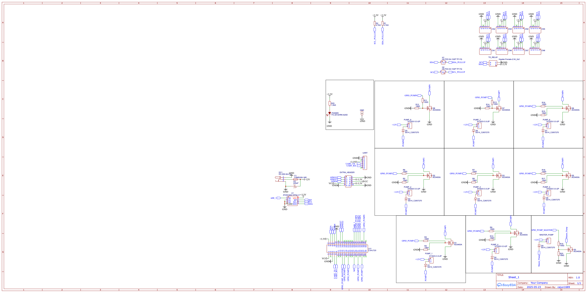

# Hydro Lite

A low-cost, two-channel control board for small hydroponic builds.  
Supports **12 V pumps**, **analog I²C sensors**, and optional
pull-up resistors on the SDA/SCL lines (see *Jumper Settings* below).

!!! tip "Quick links"
    * [Schematic PDF](../hardware/hydro-lite/hydro-lite-schematic.pdf){:target="_blank"}
    * [Purchase on JLCPCB](https://jlcpcb.com/partdetail/...) *(coming soon)*

---

## Features
| | |
|---|---|
| MCU | ATtiny1624 @ 16 MHz (Optiboot) |
| Power input | 9 – 15 V DC barrel |
| Outputs | 2 × MOSFET (5 A max each) |
| I²C header | 3-pin JST-PH (3.3 V logic) |

---

## Schematic

*(Click for full-size or download the PDF above.)*

---

## Jumper Settings – I²C Pull-ups

!!! note "H1 / H2 pull-up jumpers"
    * **Purpose:** optional 4 .7 kΩ pull-up resistors that tie **SDA** and **SCL**
      to the 3.3 V rail.  
    * **When to fit:**  
        * Analog I²C break-outs that **do not** include pull-ups.  
        * Very long I²C cable runs (> 1 m).  
    * **Safe with other devices:** resistors sit **in parallel** with any pull-ups
      already on sensor carrier boards, so closing the jumper will *not* overload the bus.

| Jumper | State | Effect |
|--------|-------|--------|
| **H1** | *Open* (default) | No pull-up on **SDA** |
|        | *Closed* | Adds 4 .7 kΩ pull-up to **SDA** |
| **H2** | *Open* (default) | No pull-up on **SCL** |
|        | *Closed* | Adds 4 .7 kΩ pull-up to **SCL** |

---

## Bill of Materials (BOM)

| Qty | Ref | Part | LCSC / Mfr # |
|----:|-----|------|--------------|
| 1 | U1 | ATtiny1624-SS | C347880 |
| 2 | Q1-Q2 | AO4407A MOSFET | C10486 |
| … | … | … | … |

*(The full CSV is at `/hardware/hydro-lite/bom.csv`.)*

---

## Assembly & Test Steps

1. Solder MCU, crystal, and power section first.  
2. Power up at 9 V and verify 3.3 V regulator output.  
3. Flash Optiboot via the UPDI header.  
4. Attach a pump and run **blink-pump.py** to test MOSFET drive.

---

## Revision History

| Rev | Date | Notes |
|-----|------|-------|
| v1.0.0 | 2025-06-10 | First public release |
