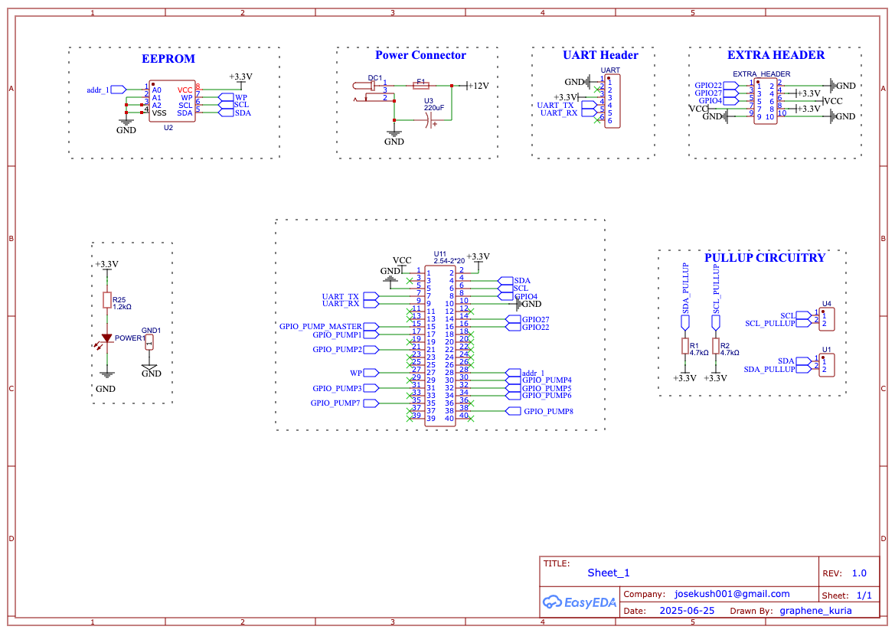
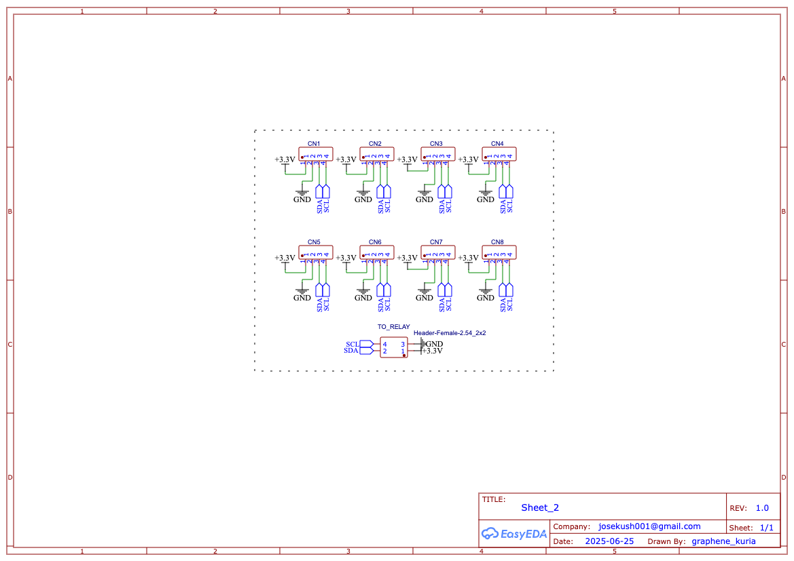
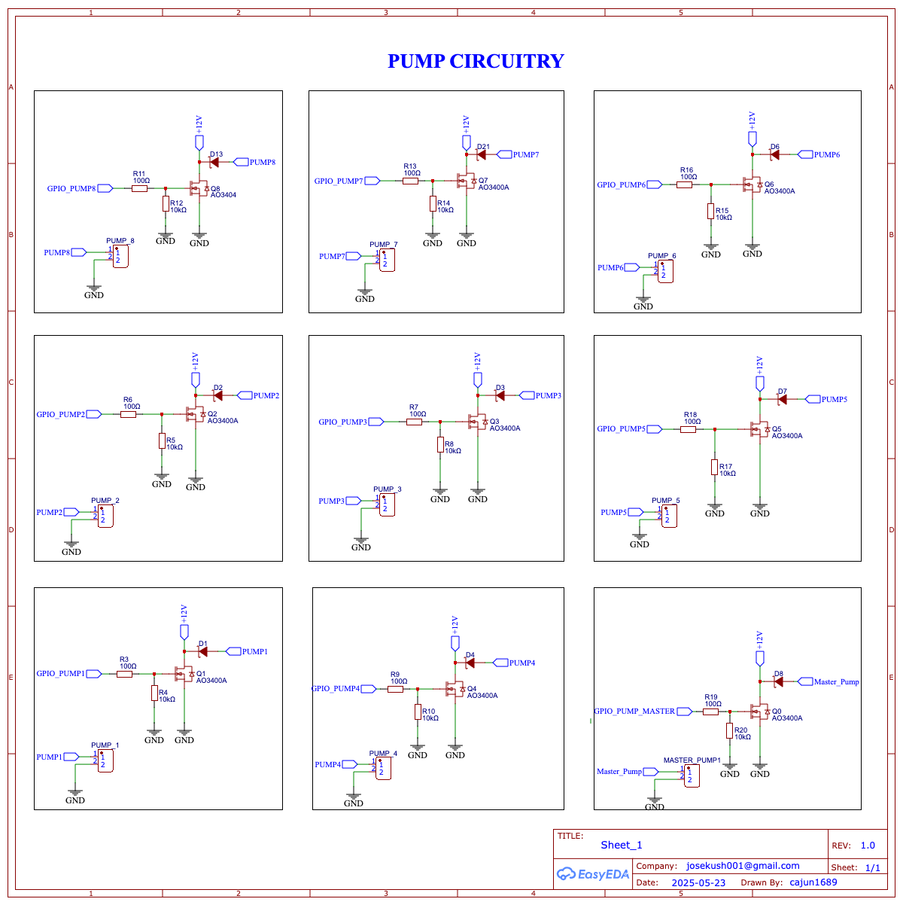

# Hydro Lite

A compact control board for automated hydroponic systems.  
It drives **eight 12 V nutrient-dosing pumps plus one 12 V master pump**, letting you pre-mix before filling the reservoir.  
No soldering is required—boards arrive fully assembled and electrically tested (sold on Amazon).

!!! tip "Quick links"
    * [Schematic PDF](../hardware/hydro-lite/hydro-lite-schematic.pdf)
    * [Buy pre-assembled on Amazon](https://amazon.com/your-listing) *(coming soon)*

---

## Features
| &nbsp; | &nbsp; |
|---|---|
| MCU | ATtiny1624 @ 16 MHz (Optiboot) |
| Pump outputs | 9 × N-MOSFET (8 nutrient, 1 master) @ 12 V / 5 A each |
| Supply | 9 – 15 V DC barrel jack |
| Sensor bus | 3-pin JST-PH I²C (3 .3 V logic) |

---

## Schematic

=== "Sheet 1"

    

=== "Sheet 2"

    

=== "Board overview"

    

*(Click any sheet for the full-resolution PDF.)*

---

## Jumper Settings – I²C Pull-ups

!!! note "H1 / H2 pull-up jumpers"
    * **Purpose:** adds 4 .7 kΩ pull-ups to **SDA** and **SCL**.  
    * **Use when:**  
        * A sensor board *lacks* pull-ups, **or**  
        * Cable length > 1 m.  
    * Extra pull-ups sit **in parallel** with existing ones—safe for mixed devices.

| Jumper | Default | Closed |
|--------|---------|--------|
| **H1 (SDA)** | open | adds 4 .7 kΩ pull-up |
| **H2 (SCL)** | open | adds 4 .7 kΩ pull-up |

---

## Bill of Materials (updated)

| ID | Name | Designator(s) | Footprint | Qty | Manufacturer Part | Manufacturer | Supplier | Supplier Part | Price (USD) |
|---:|---|---|---|---:|---|---|---|---|---:|
| 1 | ZX-HY2.0-4PZZ | CN1,CN2,CN3,CN4,CN5,CN6,CN7,CN8 | CONN-TH_4P-P2.00_HX20020-4A_2 | 8 | ZX-HY2.0-4PZZ | Megastar | LCSC | C7429580 | 0.026 |
| 2 | B340A-13-F | D1,D2,D3,D4,D6,D7,D8,D13,D21 | SMA_L4.4-W2.6-LS5.0-RD | 9 | B340A-13-F | DIODES | LCSC | C85098 | 0.059 |
| 3 | PZ254V-12-10P | EXTRA_HEADER | HDR-TH_10P-P2.54-V-M-R2-C5-S2.54 | 1 | PZ254V-12-10P | XFCN | LCSC | C492422 | 0.053 |
| 4 | AO3404 | Q8 | SOT-23-3_L2.9-W1.3-P1.90-LS2.4-BR | 1 | AO3404 | Hottech | LCSC | C192925 | 0.038 |
| 5 | XY302V-3.5-2P | MASTER_PUMP1,PUMP_1-8 | CONN-TH_XY302V-3.5-2P | 9 | XY302V-3.5-2P | Xinlaiya | LCSC | C784940 | 0.141 |
| 6 | FC-2012HRK-620D | POWER1 | LED0805-R-RD | 1 | NCD0805R1 | NationStar | LCSC | C84256 | 0.014 |
| 7 | CAT24C32WI-GT3 | U2 | SOIC-8_L5.0-W4.0-P1.27-LS6.0-BL | 1 | CAT24C32WI-GT3 | ON Semi | LCSC | C236187 | 0.145 |
| 8 | 2.54-2 × 20 | U11 | HDR-TH_40P-P2.54-V-F-R2-C20-S2.54 | 1 | 2.54-2 × 20 | ZHOURI | LCSC | C2977589 | 0.217 |
| 9 | AO3400A | Q1-Q7,Q9 | SOT-23-3_L2.9-W1.3-P1.90-LS2.4-BR | 8 | AO3400A | AOS | LCSC | C20917 | 0.078 |
| 10 | 4 × 7 kΩ | R1-R2 | R0402 | 2 | 0402WGF4701TCE | Uni-Royal | LCSC | C25900 | 0.001 |
| 11 | 100 Ω | R3,R6-R7,R9,R11,R13,R16-R19 | R0603 | 9 | RC0603FR-07100RL | Yageo | LCSC | C105588 | 0.001 |
| 12 | 10 kΩ | R4-R5,R8,R10,R12,R14-R15,R17,R20 | R0603 | 9 | RC0603FR-0710KL | Yageo | LCSC | C98220 | 0.001 |
| 13 | 1.96 kΩ | R21 | R0603 | 1 | RC0603FR-071K96L | Yageo | LCSC | C185352 | 0.001 |
| 14 | 1.2 kΩ | R25 | R0402 | 1 | ERJ2RKF1201X | Panasonic | LCSC | C413082 | 0.006 |
| 15 | 4.7 µF | STPC1-STPC2 | C1206 | 2 | 1206B475K500NT | FH | LCSC | C29823 | 0.034 |
| 16 | 10 nF | STPC3,STPC5 | C0603 | 2 | 0603B103K500NT | FH | LCSC | C57112 | 0.002 |
| 17 | 100 nF | STPC4 | C0603 | 1 | CC0603KRX7R9BB104 | Yageo | LCSC | C14663 | 0.003 |
| 18 | 1 nF | STPC6 | C0603 | 1 | CL10B102KB8NNNC | Samsung | LCSC | C1588 | 0.003 |
| 19 | 47 pF | STPC7 | C0603 | 1 | CL10C470JB8NNNC | Samsung | LCSC | C1671 | 0.004 |
| 20 | 47 µF | STPC8-STPC9 | C1206 | 2 | CL31A476MPHNNNE | Samsung | LCSC | C96123 | 0.071 |
| 21 | Green LED | STPLD1 | LED0603 | 1 | 19-217/GHC-YR1S2/3T | Everlight | LCSC | C72043 | 0.044 |

*Download the full CSV:* [hardware/hydro-lite/bom.csv](../hardware/hydro-lite/bom.csv)

---

## Controlling the Pumps

Each MOSFET channel is wired to a dedicated Raspberry Pi GPIO pin.  
Set the pin **HIGH** to energise the MOSFET and run the pump; set it **LOW** to stop.

| Connector label | Pi GPIO |
|-----------------|---------|
| **Master Pump** | 6  |
| **Pump 1** | 13 |
| **Pump 2** | 26 |
| **Pump 3** | 16 |
| **Pump 4** | 12 |
| **Pump 5** | 5  |
| **Pump 6** | 25 |
| **Pump 7** | 24 |
| **Pump 8** | 23 |

### Calibration workflow

1. **Prime** each pump tubing with water or nutrient.  
2. In your control software (Python, Node-RED, etc.) turn one pump **on** for a known time — e.g. **30 seconds**.  
3. Measure the volume dispensed (graduated cylinder works well).  
4. Repeat **3–5 times** and average the results to spot any deviation.  
5. Enter that ml/sec (or ml/min) rate into your dosing algorithm.

> **Tip:** Re-calibrate whenever you change tubing length, pump voltage, or fluid viscosity.

---

## Assembly & Test

Boards purchased on Amazon are **pre-assembled and tested**.  
For DIY assembly:

1. Solder MCU, regulator, and passives.  
2. Apply 9 V; verify 3 .3 V rail.  
3. Flash Optiboot via the UPDI header.  
4. Run **blink-pump.py** to toggle each MOSFET and confirm outputs.

---

## Revision History

| Rev | Date | Notes |
|-----|------|-------|
| v1.0.0 | 2025-06-10 | First public release |
