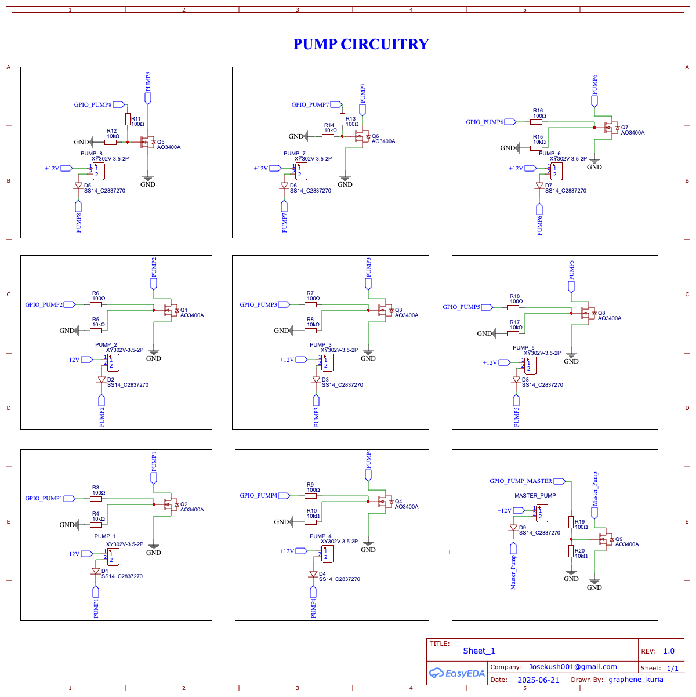
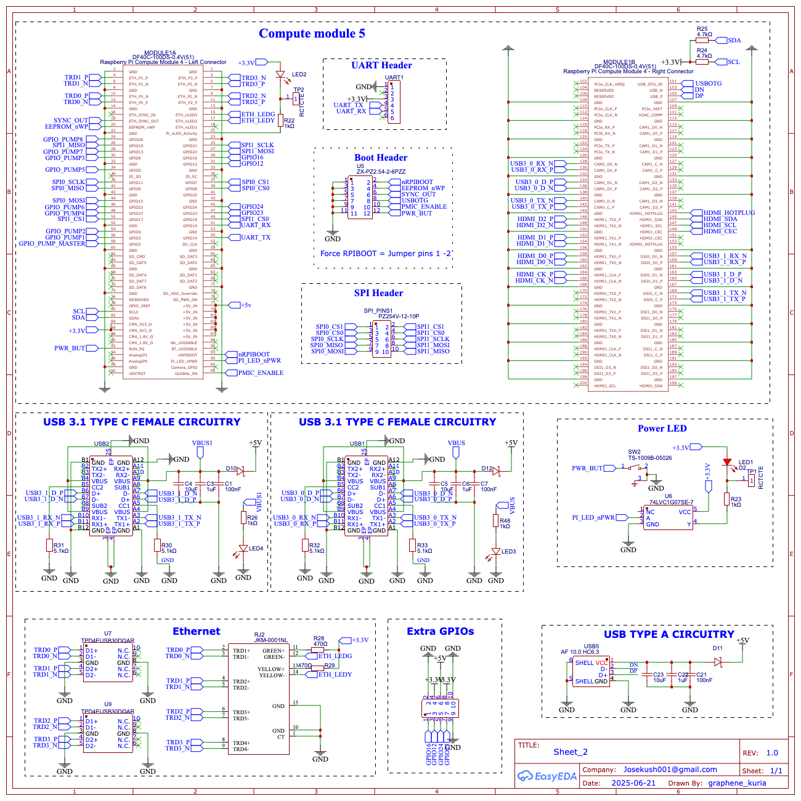
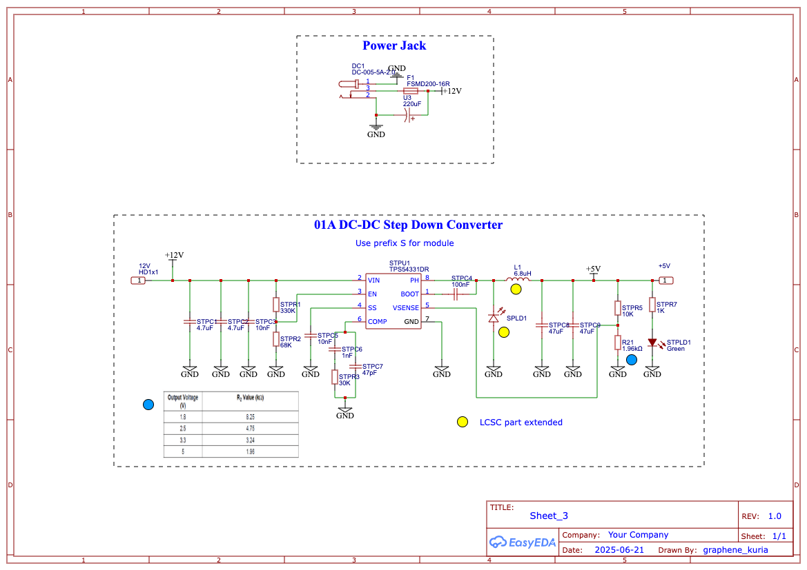
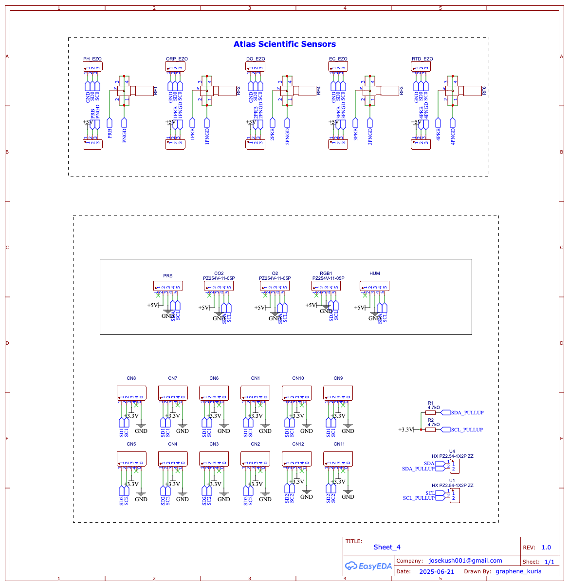
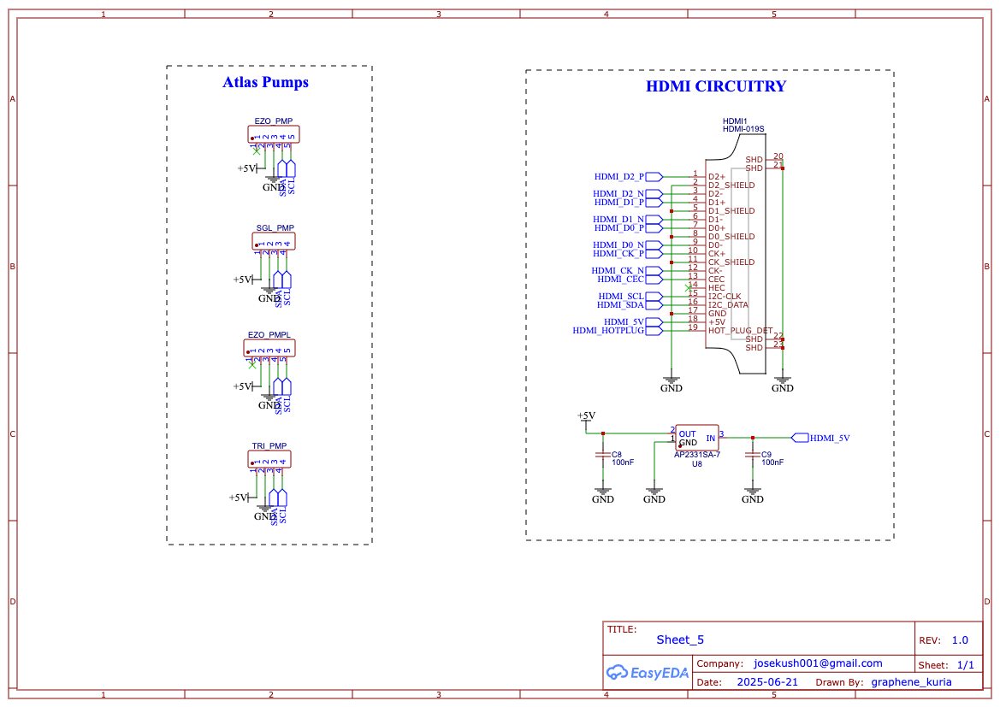
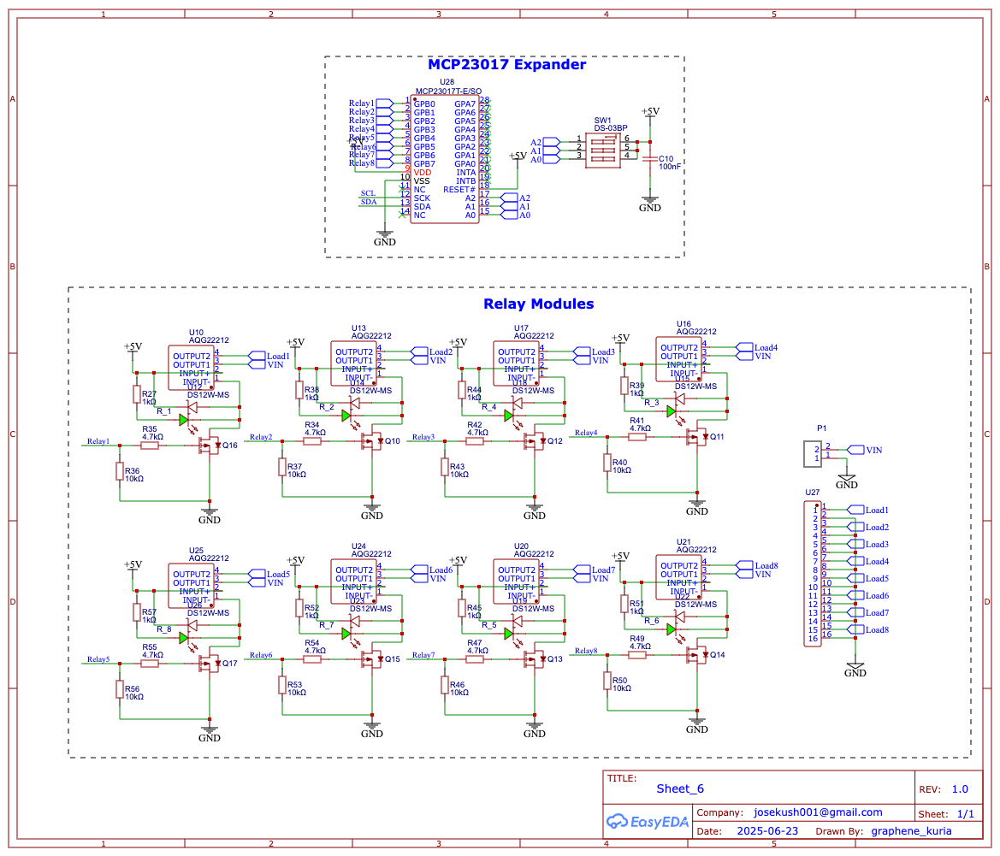
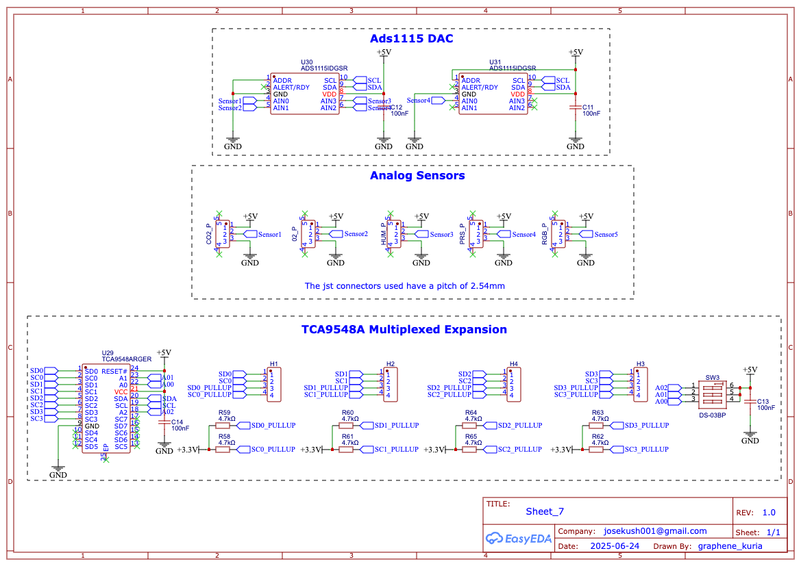

# ED3N **Hydro Pro**

All-in-one controller with an on-board **Raspberry Pi 5 Compute Module**,  
three I²C buses (one dedicated to Atlas EZO™), and integrated isolated / non-isolated
carrier footprints. Just plug in the EZO board, connect the probe or pump, and grow.

!!! tip "Quick links"
    * **Schematic PDF** — [download](../hardware/hydro-pro/Schematic_Hydro-Pro_2025-06-27.pdf)
    * **Full BOM (CSV)** — [hardware/hydro-pro/bom.csv](../hardware/hydro-pro/bom.csv)
    * **Buy pre-assembled on Amazon** — *(listing coming soon)*

> **No soldering required** — boards ship fully populated and electrically tested.

---

## Feature Highlights

|  |  |
|---|---|
| Compute | **Raspberry Pi 5 Compute Module** (CM5) on board |
| Pump outputs | 9 × N-MOSFET (8 nutrient, 1 master) · 12 V / 5 A each |
| I²C buses | 3 total — **Bus 2 reserved for Atlas headers** |
| Atlas support | 10 EZO™ headers (5 carrier footprints + 5 bare-module) |
| Generic sensors | 8 × JST-PH I²C (2 .54 mm pitch) |
| Supply | 9 – 15 V DC barrel · on-board 5 V / 3 A buck for Pi & peripherals |
| Board size | 85 × 65 mm · 4-layer ENIG |

---

## Schematic

=== "Sheet 1 – Pump FETs"

    

=== "Sheet 2 – CM5 connectors"

    

=== "Sheet 3 – 5 V buck & power"

    

=== "Sheet 4 – I²C pull-ups & JST bus"

    

=== "Sheet 5 – Atlas carrier area"

    

=== "Sheet 6 – Relay modules"

    

=== "Sheet 7 – TCA9548A mux + ADS1115"

    

*(Click any sheet for the full-resolution PDF.)*

---

## Pump Control

| Connector | Pi GPIO |
|-----------|--------:|
| Master pump | 6 |
| Pump 1 | 13 |
| Pump 2 | 26 |
| Pump 3 | 16 |
| Pump 4 | 12 |
| Pump 5 | 5 |
| Pump 6 | 25 |
| Pump 7 | 24 |
| Pump 8 | 23 |

`HIGH` → pump **ON** · `LOW` → pump **OFF**.  
**Calibration:** run each pump for a fixed time (e.g. 30 s), measure volume, repeat ×3–5, average mL / s.

---

## I²C Pull-up Jumpers

| Jumper | Default | Closed |
|--------|---------|--------|
| **H1 (SDA)** | open | adds 4 · 7 kΩ pull-up |
| **H2 (SCL)** | open | adds 4 · 7 kΩ pull-up |

Enable if sensors lack pull-ups or cable > 1 m. Extra resistors sit in parallel with existing ones.

---

## Native Atlas Scientific EZO™ Support

Hydro Pro exposes **10 Atlas headers** (GND · 3 V3 · SDA · SCL).

| Group | Qty | Typical sensors | Carrier board? |
|-------|----:|-----------------|----------------|
| Carrier EZO™ | 5 | pH, ORP, DO, EC, RTD | **Yes** |
| Bare-module EZO™ | 5 | CO₂, O₂, Humidity, Pressure, RGB | No |

### Switching EZO™ boards from UART → I²C

1. Short the I²C pads on each board  
   (<https://www.instructables.com/UART-AND-I2C-MODE-SWITCHING-FOR-ATLAS-SCIENTIFIC-E/>)  
   – or use the \$13 [I²C Toggler](https://atlas-scientific.com/ezo-accessories/i2c-toggler/).  
2. Re-power → default address **0x61**.  
3. Plug into any Atlas header.

!!! note
    Hydro Pro presents 8 JST + 10 Atlas = 18 physical ports.  
    Keep **≤ 16 devices** total for robust I²C signalling.

---

## Bill of Materials (70 items)

| ID | Name | Designator(s) | Footprint | Qty | Mfr Part | Manufacturer | Supplier | Supplier Part | $ |
|---:|---|---|---|---:|---|---|---|---|---:|
| 1 | BX-XH2.54-3PLT | 02_P, CO2_P, HUM_P, PRS_P, RGB_P | CONN-SMD 3P-P2.50 | 5 | BX-XH2.54-3PLT | Bossie | LCSC | C18077882 | 0.071 |
| 2 | 100 nF | C1,C7,C10-C14,C21 | C0603 | 8 | CC0603KRX7R6BB104 | Yageo | LCSC | C519438 | 0.003 |
| 3 | 1 µF | C3,C6,C22 | C0603 | 3 | 0603X105K6R3CT | Walsin | LCSC | C152900 | 0.006 |
| 4 | 10 µF | C4,C5,C23 | C0603 | 3 | CL10A106MQ8NNNC | Samsung | LCSC | C1691 | 0.005 |
| 5 | 100 nF | C8,C9 | C0603 | 2 | CL10B104KA8NNNC | Samsung | LCSC | C1590 | 0.003 |
| 6 | BM04B-SRSS-TB | CN1-CN12 | CONN-SMD_BM04B-SRSS-TB | 12 | BM04B-SRSS-TB(LF)(SN) | JST | LCSC | C160390 | 0.186 |
| 7 | PZ254V-11-05P | CO2, EZO_PMP, EZO_PMPL, HUM, O2, PRS, RGB1 | HDR-TH 5P-P2.54 | 7 | PZ254V-11-05P | XFCN | LCSC | C492404 | 0.028 |
| 8 | SS14 | D1-D9 | SMA_L4.3-W2.6 | 9 | SS14 | JSMSEMI | LCSC | C2837270 | 0.012 |
| 9 | VS-10BQ015HM3/5BT | D10-D12 | SMB_L4.6-W3.6 | 3 | VS-10BQ015HM3/5BT | Vishay | LCSC | C413465 | 0.254 |
| 10 | DC-005-5A-2.0 | DC1 | DC-IN-TH_DC-005-5A-2.0 | 1 | DC-005-5A-2.0 | XKB | LCSC | C381116 | 0.217 |
| 11 | 22025403P00CKMT | DO_EZO, EC_EZO, H5-H8, H10, ORP_EZO, PH_EZO, RTD_EZO | HDR-TH 3P-P2.54 | 10 | B-2200S03P-A120 | Ckmtw | LCSC | C146690 | 0.086 |
| 12 | PZ254V-12-10P | EXTRA_HEADER1, SPI_PINS1 | HDR-TH 10P-P2.54 | 2 | PZ254V-12-10P | XFCN | LCSC | C492422 | 0.053 |
| 13 | FSMD200-16R | F1 | F1812 | 1 | FSMD200-16R | Fuzetec | LCSC | C220154 | 0.096 |
| 14 | PZ254V-11-04P | H1-H4, SGL_PMP, TRI_PMP | HDR-TH 4P-P2.54 | 6 | PZ254V-11-04P | XFCN | LCSC | C2691448 | 0.020 |
| 15 | HDMI-019S | HDMI1 | HDMI-SMD_HDMI-019S | 1 | HDMI-019S | SOFNG | LCSC | C111617 | 0.269 |
| 16 | 6.8 µH | L1 | L0805 | 1 | MGFL2012F6R8MT-LF | Microgate | LCSC | C486332 | 0.023 |
| 17 | 19-217/R6C | LED1 | LED0603_RED | 1 | 19-217/R6C-AL1M2VY/3T | Everlight | LCSC | C72044 | 0.021 |
| 18 | A-SP192DGHC-C01-4T | LED2 | LED0603-FD | 1 | A-SP192DGHC-C01-4T | Amicc | LCSC | C19171301 | 0.023 |
| 19 | XL-1608UBC-04 | LED3,LED4 | LED0603-BLUE | 2 | XL-1608UBC-04 | Xinglight | LCSC | C965807 | 0.004 |
| 20 | XY302V-3.5-2P | MASTER_PUMP, PUMP_1-8 | CONN-TH_XY302V-3.5-2P | 9 | XY302V-3.5-2P | Xinlaiya | LCSC | C784940 | 0.141 |
| 21 | DF40C-100DS-0.4V(51) | MODULE1A | RPI CM 4 - Left | 1 | DF40C-100DS-0.4V(51) | Hirose | LCSC | C597931 | 0.912 |
| 22 | DF40C-100DS-0.4V(51) | MODULE1B | RPI CM 4 - Right | 1 | DF40C-100DS-0.4V(51) | Hirose | LCSC | C597931 | 0.912 |
| 23 | WJ500V-5.08-2P-14-00A | P1 | CONN-TH 2P-P5.00 | 1 | WJ500V-5.08-2P | KANGNEX | LCSC | C8465 | 0.099 |
| 24 | AO3400A | Q1-Q9 | SOT-23-3 | 9 | AO3400A | AOS | LCSC | C20917 | 0.075 |
| 25 | SI2305CDS-T1-GE3 | Q10-Q17 | SOT-23-3 | 8 | SI2305CDS-T1-GE3 | Vishay | LCSC | C37577 | 0.087 |
| 26 | 4.7 kΩ | R1,R2,R24-R27,R58-R65 | R0402 | 12 | 0402WGF4701TCE | Uni-Royal | LCSC | C25900 | 0.001 |
| 27 | 100 Ω | R3,R6-R7,R9,R11,R13,R16,R18,R19 | R0603 | 9 | RC0603FR-07100RL | Yageo | LCSC | C105588 | 0.001 |
| 28 | 10 kΩ | R4,R5,R8,R10,R12,R14,R15,R17,R20 | R0603 | 9 | RC0603FR-0710KL | Yageo | LCSC | C98220 | 0.001 |
| 29 | 1.96 kΩ | R21 | R0603 | 1 | RC0603FR-071K96L | Yageo | LCSC | C185352 | 0.001 |
| 30 | 1 kΩ | R22,R23 | R0603 | 2 | RS-03K1001FT | FH | LCSC | C115325 | 0.001 |
| 31 | 1 kΩ | R26,R27,R38,R39,R44,R45,R48,R51,R52,R57 | R0603 | 10 | 0603WAJ0102T5E | Uni-Royal | LCSC | C25585 | 0.001 |
| 32 | 470 Ω | R28,R29 | R0603 | 2 | RC0603FR-07470RL | Yageo | LCSC | C114669 | 0.001 |
| 33 | 5.1 kΩ | R30-R33 | R0603 | 4 | SCR0603J5K1 | VO | LCSC | C3017721 | 0.001 |
| 34 | 4.7 kΩ | R34,R35,R41,R42,R47,R49,R54,R55 | R0201 | 8 | 0201WMF4701TEE | Uni-Royal | LCSC | C270346 | 0.001 |
| 35 | 10 kΩ | R36,R37,R40,R43,R46,R50,R53,R56 | R0603 | 8 | RTT03103JTP | RALEC | LCSC | C103210 | 0.001 |
| 36 | BWSMA-KWE-Z001 | RF1-RF4,RF6 | SMA-TH_BWSMA-KWE-Z001 | 5 | BWSMA-KWE-Z001 | Bat Wireless | LCSC | C496551 | 0.459 |
| 37 | JKM-0001NL | RJ2 | RJ45-TH_JKM-0001NL | 1 | JKM-0001NL | PULSE | LCSC | C428627 | 3.490 |
| 38 | XL-302UGD | R_1-R_8 | LED-TH_BD3.8-P2.54 | 8 | XL-302UGD | Xinglight | LCSC | C2895476 | 0.023 |
| 39 | 19-217/GHC-YR1S2/6T | SPLD1 | LED0603_GREEN | 1 | 19-217/GHC-YR1S2/6T | Everlight | LCSC | C2986059 | 0.017 |
| 40 | 4.7 µF | STPC1,STPC2 | C1206 | 2 | 1206B475K500NT | FH | LCSC | C29823 | 0.034 |
| 41 | 10 nF | STPC3,STPC5 | C0603 | 2 | 0603B103K500NT | FH | LCSC | C57112 | 0.002 |
| 42 | 100 nF | STPC4 | C0603 | 1 | CC0603KRX7R9BB104 | Yageo | LCSC | C14663 | 0.002 |
| 43 | 1 nF | STPC6 | C0603 | 1 | CL10B102KB8NNNC | Samsung | LCSC | C1588 | 0.003 |
| 44 | 47 pF | STPC7 | C0603 | 1 | CL10C470JB8NNNC | Samsung | LCSC | C1671 | 0.004 |
| 45 | 47 µF | STPC8,STPC9 | C1206 | 2 | CL31A476MPHNNNE | Samsung | LCSC | C96123 | 0.071 |
| 46 | Green LED | STPLD1 | LED0603_GREEN | 1 | 19-217/GHC-YR1S2/3T | Everlight | LCSC | C2986059 | 0.017 |
| 47 | 330 kΩ | STPR1 | R0603 | 1 | 0603WAF3303T5E | UniOhm | LCSC | C23137 | 0.001 |
| 48 | 68 kΩ | STPR2 | R0603 | 1 | 0603WAF6802T5E | UniOhm | LCSC | C23231 | 0.001 |
| 49 | 30 kΩ | STPR3 | R0603 | 1 | 0603WAF3002T5E | UniOhm | LCSC | C22984 | 0.001 |
| 50 | 10 kΩ | STPR5 | R0603 | 1 | 0603WAF1002T5E | UniOhm | LCSC | C25804 | 0.001 |
| 51 | 1 kΩ | STPR7 | R0603 | 1 | 0603WAF1001T5E | UniOhm | LCSC | C21190 | 0.001 |
| 52 | TPS54331DR | STPU1 | SOIC-8 | 1 | TPS54331DR | TI | LCSC | C9865 | 0.225 |
| 53 | DS-03BP | SW1,SW3 | SW-TH_DS-03XP | 2 | DS-03BP | Han Rong | LCSC | C129069 | 0.272 |
| 54 | TS-1009B-05026 | SW2 | SW-TH_3P-L4.5-W3.8-P3.10 | 1 | TS-1009B-05026 | XUNPU | LCSC | C455252 | 0.060 |
| 55 | RCTCTE test pin | TP1,TP2 | TEST-PIN_0805-2.0 | 2 | RCTCTE | KOA | LCSC | C172771 | 0.088 |
| 56 | HX PZ2.54-1×2P | U1,U4 | HDR-TH 2P-P2.54 | 2 | HX PZ2.54-1×2P | Hanxia | LCSC | C32713268 | 0.014 |
| 57 | 220 µF | U3 | CAP-TH_D6.3 | 1 | 25V220µF CD288 | HRK | LCSC | C2960221 | 0.028 |
| 58 | ZX-PZ2.54-2-6PZZ | U5 | HDR-TH 12P-P2.54 | 1 | ZX-PZ2.54-2-6PZZ | Megastar | LCSC | C7501277 | 0.063 |
| 59 | 74LVC1G07SE-7 | U6 | SC-88A | 1 | 74LVC1G07SE-7 | DIODES | LCSC | C67531 | 0.043 |
| 60 | TPD4EUSB30DQAR | U7,U9 | USON-10 | 2 | TPD4EUSB30DQAR | TI | LCSC | C90627 | 0.523 |
| 61 | AP2331SA-7 | U8 | SOT-23-3 | 1 | AP2331SA-7 | DIODES | LCSC | C500764 | 0.090 |
| 62 | AQG22212 | U10,U13,U16,U17,U20-U25 | RELAY-TH_AQGX2 | 8 | AQG22212 | Panasonic | LCSC | C719647 | 2.653 |
| 63 | DS12W-MS | U12,U14,U15,U18,U19,U22,U23,U26 | SOD-123FL | 8 | DS12W-MS | MSKSEMI | LCSC | C5120757 | 0.021 |
| 64 | DB128V-5.08-16P | U27 | CONN-TH 16P-P5.08 | 1 | DB128V-5.08-16P-GN-S | DORABO | LCSC | C5143714 | 1.347 |
| 65 | MCP23017T-E/SO | U28 | SOIC-28 | 1 | MCP23017T-E/SO | Microchip | LCSC | C629440 | 1.948 |
| 66 | TCA9548ARGER | U29 | VQFN-24 | 1 | TCA9548ARGER | TI | LCSC | C555456 | 0.746 |
| 67 | ADS1115IDGSR | U30,U31 | MSOP-10 | 2 | ADS1115IDGSR | TI | LCSC | C37593 | 1.091 |
| 68 | Header Female 1×6 | UART1 | HDR-TH 6P-P2.54 | 1 | 2.54-1×6P 母 | BOOMELE | LCSC | C40877 | 0.070 |
| 69 | TYPE-C 24P QT | USB1,USB2 | USB-C-SMD | 2 | TYPE-C 24P QT | SHOU HAN | LCSC | C2681555 | 0.483 |
| 70 | AF 10.0 HC6.3 | USB5 | USB-A-TH_AF-10.0-HC6.3 | 1 | AF 10.0 HC6.3 | SHOU HAN | LCSC | C456017 | 0.046 |

---

## Revision History

| Rev | Date | Notes |
|----:|------|-------|
| v1.0.0 | 2025-06-27 | First public release |