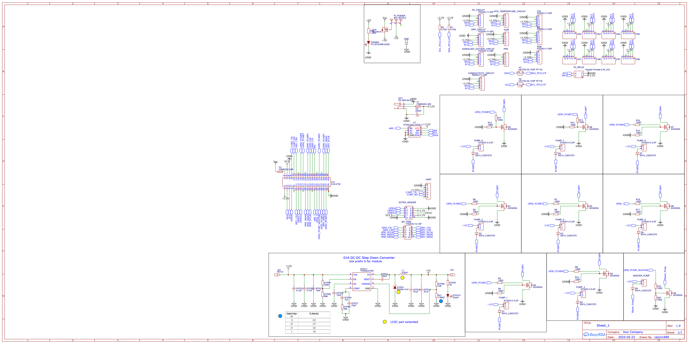

# ED3N Hydro

Everything in **Hydro Basic**, plus Pi power-backfeed and native Atlas Scientific EZO™ support—ideal for growers upgrading from hobby probes to research-grade sensors.

!!! tip "Quick links"
    * **Schematic PDF** — [download](../hardware/hydro/hydro-schematic.pdf)
    * **Full BOM (CSV)** — [hardware/hydro/bom.csv](../hardware/hydro/bom.csv)
    * **Buy pre-assembled on Amazon** — *(listing coming soon)*

> **No soldering required** — boards ship fully assembled and electrically tested.

---

## Feature Highlights

| &nbsp; | &nbsp; |
|---|---|
| MCU | ATtiny1624 @ 16 MHz (Optiboot) |
| Pump outputs | 9 × N-MOSFET (8 nutrient, 1 master) · 12 V / 5 A each |
| Raspberry Pi power | 5 V / 3 A backfeed via 40-pin header • Slide switch (`PI_POWER`) enables/disables • Blue LED lights when 5 V rail is active |
| Sensor inputs | 8 × JST-PH I²C **plus** 4 × Atlas EZO™ headers |
| Supply | 9 – 15 V DC barrel jack |
| Footprint | 65 × 56 mm · 2-layer ENIG |

---

## Schematic

*(Click the image for the PDF.)*

---

## Powering the Raspberry Pi

| Item | Description |
|------|-------------|
| **Slide switch** (`PI_POWER`) | **OFF** → Pi not powered by board · **ON** → 5 V rail energised |
| **Blue LED** | Indicates Pi-power rail is on |

> **Caution:** Do **not** feed 5 V to the Pi from another source while `PI_POWER` is **ON**.

---

## Native Atlas Scientific EZO™ Support

Four headers expose **TX, RX, SDA, SCL, 3 V3, GND** for Atlas EZO™ circuits.

### Switching EZO™ boards from UART → I²C

1. Short the I²C solder jumpers on each EZO board  
   *(see Atlas guide: <https://www.instructables.com/UART-AND-I2C-MODE-SWITCHING-FOR-ATLAS-SCIENTIFIC-E/>)*  
   – or use the \$13 **I²C Toggler**: <https://atlas-scientific.com/ezo-accessories/i2c-toggler/>  
2. Power-cycle the circuit → it now defaults to address `0x61`.  
3. Plug into any EZO header on the Hydro board.

!!! note
    The Hydro isn’t intended to run every connector at once.  
    Use **all 8 JST ports plus up to 6 EZO ports** *or* all 4 EZO ports and fewer JST ports. As you migrate to EZO sensors, remove redundant consumer-grade probes.

---

## Pull-up-Resistor Jumpers (I²C)

| Jumper | Default | Closed |
|--------|---------|--------|
| **H1 (SDA)** | open | adds 4 .7 kΩ pull-up |
| **H2 (SCL)** | open | adds 4 .7 kΩ pull-up |

Use when sensors lack pull-ups or cable runs > 1 m. Extra pull-ups sit in parallel with existing ones.

---

## Pump Control

| Connector | Pi GPIO |
|-----------|---------|
| Master Pump | 6  |
| Pump 1 | 13 |
| Pump 2 | 26 |
| Pump 3 | 16 |
| Pump 4 | 12 |
| Pump 5 | 5  |
| Pump 6 | 25 |
| Pump 7 | 24 |
| Pump 8 | 23 |

Set GPIO **HIGH** → pump ON · **LOW** → pump OFF.

**Calibration:** run a pump for a fixed time (e.g. 30 s), measure volume, repeat 3–5×, average ml/s, and enter into your dosing software.

---

## Bill of Materials (full table)

| ID | Name | Designators | Footprint | Qty | Mfr Part | Manufacturer | Supplier | Part # | Price (USD) | Pins | JLC Class |
|----|------|-------------|-----------|----:|---------|--------------|----------|--------|-------------|------|-----------|
| 1 | PZ254V-11-05P | C02, CONDUCTIVITY_CIRCUIT, … | HDR-TH 5P-P2.54-V-M | 10 | PZ254V-11-05P | XFCN | LCSC | C492404 | 0.028 | 5 | Extended |
| 2 | BM04B-SRSS-TB | CN1–CN8 | CONN-SMD_BM04B-SRSS-TB | 8 | BM04B-SRSS-TB | JST | LCSC | C160390 | 0.183 | 5 | Extended |
| 3 | SS14 | D1–D9 | SMA_L4.3-W2.6 | 9 | SS14 | JSMSEMI | LCSC | C2837270 | 0.012 | 2 | Extended |
| 4 | DC-005-5A-2.0 | DC1 | DC-IN-TH | 1 | DC-005-5A-2.0 | XKB | LCSC | C381116 | 0.216 | 3 | Extended |
| 5 | PZ254V-12-10P | EXTRA_HEADER, SPI_PINS | HDR-TH 10P-P2.54 | 2 | PZ254V-12-10P | XFCN | LCSC | C492422 | 0.053 | 10 | Extended |
| 6 | FSMD200-16R | F1, F2 | F1812 | 2 | FSMD200-16R | FUZETEC | LCSC | C220154 | 0.096 | 2 | Extended |
| 7 | HX PZ2.54-1×2P | H1, H2 | HDR-SMD_HX-PZ2.54 | 2 | HX PZ2.54-1×2P | hanxia | LCSC | C41417359 | 0.023 | 2 | Extended |
| 8 | 6.8 µH | L1 | L0805 | 1 | MGFL2012F6R8MT-LF | microgate | LCSC | C486332 | 0.023 | 2 | Extended |
| 9 | XY302V-3.5-2P | MASTER_PUMP, PUMP 1-8 | CONN-TH_XY302V | 9 | XY302V-3.5-2P | XINLAIYA | LCSC | C784940 | 0.141 | 2 | Extended |
| 10 | SS-12D10L3 | PI_POWER | SW-TH_SS-12D10L3 | 1 | SS-12D10L3 | XKB | LCSC | C319013 | 0.253 | 3 | Extended |
| 11 | FC-2012HRK-620D | POWER | LED0805-R-RD | 1 | NCD0805R1 | NationStar | LCSC | C84256 | 0.014 | 2 | Basic |
| 12 | AO3400A | Q1–Q9 | SOT-23-3 | 9 | AO3400A | AOS | LCSC | C20917 | 0.078 | 3 | Basic |
| 13 | AO3401A | Q10 | SOT-23 | 1 | AO3401A | AOS | LCSC | C15127 | 0.054 | 3 | Basic |
| 14 | 4.7 kΩ | R1, R2 | R0402 | 2 | 0402WGF4701TCE | UNI-ROYAL | LCSC | C25900 | 0.001 | 2 | Basic |
| 15 | 100 Ω | R3, R6-R7, R9, R11, R13, R16, R18-R19 | R0603 | 9 | RC0603FR-07100RL | YAGEO | LCSC | C105588 | 0.001 | 2 | Ext. |
| 16 | 10 kΩ | R4, R5, R8, R10, R12, R14-R15, R17, R20 | R0603 | 9 | RC0603FR-0710KL | YAGEO | LCSC | C98220 | 0.001 | 2 | Ext. |
| 17 | 1.96 kΩ | R21 | R0603 | 1 | RC0603FR-071K96L | YAGEO | LCSC | C185352 | 0.001 | 2 | Ext. |
| 18 | 1.2 kΩ | R25 | R0402 | 1 | ERJ2RKF1201X | Panasonic | LCSC | C413082 | 0.006 | 2 | Ext. |
| 19 | 4.7 µF | STPC1, STPC2 | C1206 | 2 | 1206B475K500NT | FH | LCSC | C29823 | 0.034 | 2 | – |
| 20 | 10 nF | STPC3, STPC5 | C0603 | 2 | 0603B103K500NT | FH | LCSC | C57112 | 0.002 | 2 | – |
| 21 | 100 nF | STPC4 | C0603 | 1 | CC0603KRX7R9BB104 | YAGEO | LCSC | C14663 | 0.003 | 2 | – |
| 22 | 1 nF | STPC6 | C0603 | 1 | CL10B102KB8NNNC | Samsung | LCSC | C1588 | 0.003 | 2 | – |
| 23 | 47 pF | STPC7 | C0603 | 1 | CL10C470JB8NNNC | Samsung | LCSC | C1671 | 0.004 | 2 | – |
| 24 | 47 µF | STPC8, STPC9 | C1206 | 2 | CL31A476MPHNNNE | Samsung | LCSC | C96123 | 0.071 | 2 | – |
| 25 | B340A-13-F | STPD1 | SMA | 1 | B340A-13-F | DIODES | LCSC | C85098 | 0.059 | 2 | – |
| 26 | Green LED | STPLD1 | LED0603 | 1 | 19-217/GHC-YR1S2/3T | EVERLIGHT | LCSC | C72043 | 0.044 | 2 | – |
| 27 | 330 kΩ | STPR1 | R0603 | 1 | 0603WAF3303T5E | UniOhm | LCSC | C23137 | 0.001 | 2 | – |
| 28 | 68 kΩ | STPR2 | R0603 | 1 | 0603WAF6802T5E | UniOhm | LCSC | C23231 | 0.001 | 2 | – |
| 29 | 30 kΩ | STPR3 | R0603 | 1 | 0603WAF3002T5E | UniOhm | LCSC | C22984 | 0.001 | 2 | – |
| 30 | 10 kΩ | STPR5 | R0603 | 1 | 0603WAF1002T5E | UniOhm | LCSC | C25804 | 0.001 | 2 | – |
| 31 | 1 kΩ | STPR7 | R0603 | 1 | 0603WAF1001T5E | UniOhm | LCSC | C21190 | 0.001 | 2 | – |
| 32 | TPS54331DR | STPU1 | SOIC-8 | 1 | TPS54331DR | TI | LCSC | C9865 | 0.232 | 8 | – |
| 33 | 2×2 Header | TO_RELAY | HDR-TH 4P | 1 | DS1023-2×2SF11 | CONNFLY | LCSC | C92273 | 0.068 | 4 | Ext. |
| 34 | AT24C32A | U1 | TSSOP-8 | 1 | AT24C32A-10TQ-2.7 | Microchip | LCSC | C6126694 | 2.859 | 8 | Ext. |
| 35 | 220 µF | U3 | CAP-TH_D6.3 | 1 | 25V220µF CD288 | HRK | LCSC | C2960221 | 0.028 | 2 | Ext. |
| 36 | 2.54-2×20 | U11 | HDR-TH 40P | 1 | 2.54-2×20 | ZHOURI | LCSC | C2977589 | 0.216 | 40 | Ext. |
| 37 | Header 1×6 | UART | HDR-TH 6P | 1 | 2.54-1×6P Female | BOOMELE | LCSC | C40877 | 0.070 | 6 | Ext. |

---

## Revision History

| Rev | Date | Notes |
|-----|------|-------|
| v1.0.0 | 2025-06-15 | First public release |